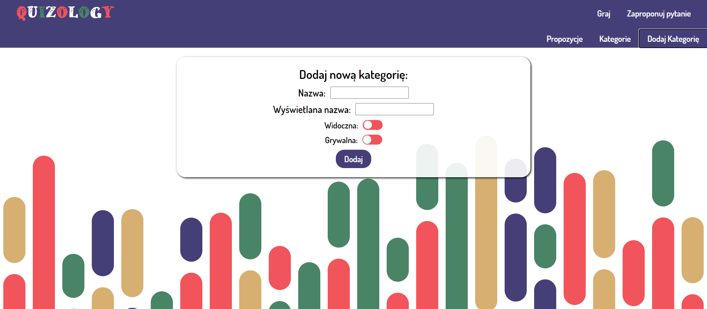

# Quizology

## LIVE: [LIVE](https://quizology.netlify.app/)
Note:
- The site is not fully responsive yet, I will fix that soon
- UI is in Polish Language

## About
Quizology is a quiz app, initialy created as my final project during CoderLab's Javascript Developer Bootcamp. This is the improved version in terms of used technologies and scaling possibilities (that's why I called it 2.0).

## Functionalities
### User is able to:
- play quiz
- suggest questions for defined categories
### Admin has aditional options and can:
- add and delete categories
- accept and reject suggested questions

## Stack
- SCSS
- Typescript
- React
- Redux
- Firebase

## To do:
- responsivness
- welcome page
- admin authentication through firebase
### In the future:
- Users accounts
- Statistics
- Visual themes

## Admin preview

